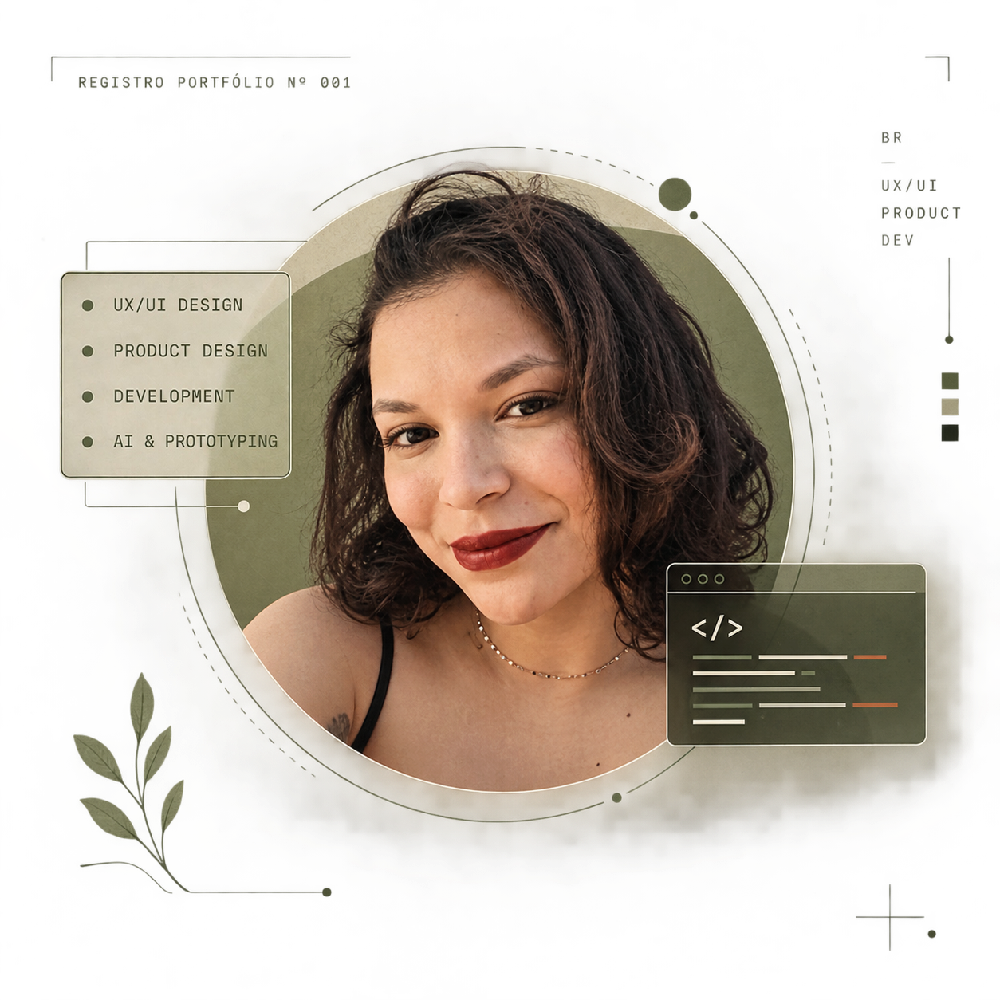

  

<table>
  <tr>
    <td>
      
    </td>
    <td>
      
    </td>
  </tr>
</table>

 

---

## Sobre mim

Olá! Eu sou a **Bruna Ribeiro**, UX/UI e Product Designer em formação, 
cursando **Análise e Desenvolvimento de Sistemas**.

Minha atuação está na interseção entre **design, produto e desenvolvimento**.
Gosto de entender problemas, estruturar experiências e transformar ideias
em interfaces e produtos digitais funcionais.

- 🎨 **UX/UI & Product Design** — fluxos, wireframes, interfaces, protótipos e design systems.
- 💻 **Desenvolvimento** — C#, .NET, APIs REST, Angular, TypeScript, HTML e CSS.
- 🧩 **Produto** — arquitetura da informação, usabilidade, interação e visão de produto.
- 🤖 **IA aplicada** — Figma Make, Lovable, Cursor, v0, ChatGPT e Claude.
- ☁️ **Cloud & Dados** — AWS, MySQL, MongoDB e Power BI.
- 🔄 **Metodologias** — Scrum, Kanban, Notion, Trello e Miro.

> Transformando problemas complexos em experiências digitais mais claras e funcionais.

---

## Minha stack

### 🎨 Design & Produto

  

### 💻 Desenvolvimento

  

### ☁️ Cloud & Ferramentas

---

### 🤖 IA & Prototipação

<!--## Projetos em destaque

### 🐾 Sumarezinhos

Plataforma digital para conectar animais disponíveis para adoção
com pessoas, protetores e organizações da comunidade local.

**UX/UI · Angular · .NET · PostgreSQL · JWT · REST API**

[Ver projeto →](LINK-DO-GITHUB)

---

### 📊 Sistema de Gestão de Fundos

Sistema interno desenvolvido para acompanhar e organizar processos
de fechamento de fundos, substituindo fluxos baseados em planilhas
e sistemas legados.

**UX/UI · Product Design · Figma · Design System · Prototipação**

[Ver case →](LINK-DO-PORTFOLIO)

---

### 🤖 AI Delivery Assistant

Conceito de uma plataforma B2B SaaS para monitorar entregas,
identificar riscos e transformar dados operacionais em informações
mais acionáveis.

**Product Design · UX/UI · AI · Dashboard · Figma Make**

[Ver case →](https://brunaribeiro.lovable.app/)

 -->

<!-- ESTATÍSTICAS DO GITHUB 

 

  -->

Designing experiences · Building products · Learning continuously

